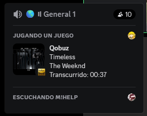
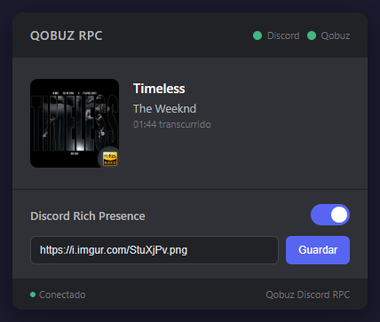

# Qobuz Discord Rich Presence — Show Your Music Activity

Display your currently playing **Qobuz** track as a Discord activity — with album art, Hi-Res Audio badge, and a local web dashboard to control everything.

## Features

- **Discord Rich Presence** — Displays current track, artist, album, and elapsed time
- **Album artwork** — Automatically fetched from iTunes Search API in high resolution (512x512)
- **Web dashboard** — Local web interface with real-time updates via WebSocket
- **Toggle on/off** — Enable or disable the Discord presence from the web UI
- **Customizable** — Change the small icon URL directly from the dashboard
- **Auto-launch** — Opens the web dashboard in your browser on startup
- **Windows only** — Detects Qobuz playback via window title (PowerShell)

## Screenshots

| Discord Activity | Web Dashboard |
|:---:|:---:|
|  |  |

## Requirements

- [Node.js](https://nodejs.org/) 18 or higher
- [Discord](https://discord.com/) desktop app running
- [Qobuz](https://www.qobuz.com/) desktop app running
- A Discord Application with its Client ID ([create one here](https://discord.com/developers/applications))

## Setup

1. **Clone the repository**

```bash
git clone https://github.com/piodois/qobuz-discord-rpc.git
cd qobuz-discord-rpc
```

2. **Install dependencies**

```bash
npm install
```

3. **Configure environment**

```bash
cp .env.example .env
```

Edit `.env` and set your Discord Client ID:

```env
DISCORD_CLIENT_ID=your_client_id_here
```

4. **Run**

```bash
npm start
```

The web dashboard opens automatically at `http://localhost:3900`.

## Configuration

| Variable | Description | Default |
|---|---|---|
| `DISCORD_CLIENT_ID` | Your Discord Application Client ID | *required* |
| `POLL_INTERVAL_MS` | How often to check Qobuz (ms) | `5000` |
| `WEB_PORT` | Web dashboard port | `3900` |
| `SMALL_IMAGE_URL` | Small icon URL in Rich Presence | `https://i.imgur.com/StuXjPv.png` |

## How it works

1. Reads the Qobuz desktop window title via PowerShell to detect the current track
2. Parses the title format: `Song (Album / Year) - Artist`
3. Fetches album artwork from iTunes Search API (cached)
4. Updates Discord Rich Presence with track info and artwork
5. Broadcasts state to the web dashboard via WebSocket in real time

## Project structure

```
qobuz-discord-rpc/
├── server.js          # Express server + WebSocket + RPC engine
├── public/
│   └── index.html     # Web dashboard (single-file frontend)
├── screenshots/
│   ├── discord-activity.png
│   └── web-app.png
├── .env               # Environment config (not committed)
├── .env.example       # Environment template
└── package.json
```

## License

[MIT](LICENSE)
